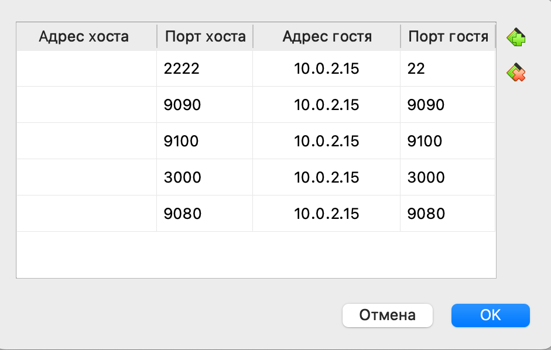
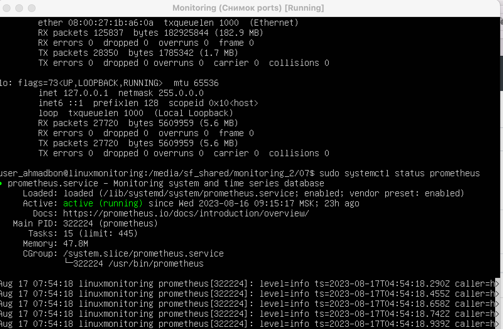
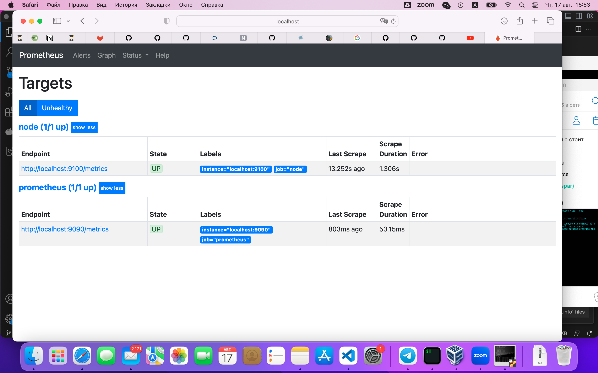
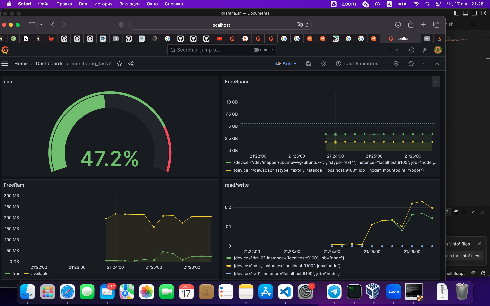
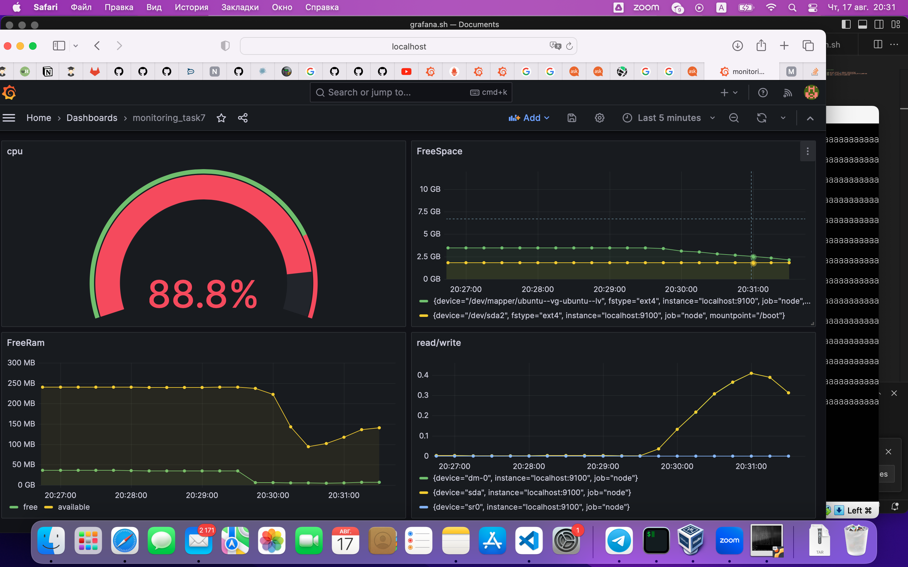

# Part 7. Prometheus и Grafana
* Проброс портов в ВМ

* статус Prometheus

* Веб интерфейс Prometheus

* Проверяем node exporter

* Запускаем стресс тест через stress -c 2 -i 1 -m 1 --vm-bytes 32M -t 10s
* Данные после

* Запускаем скрипт из задания 2

