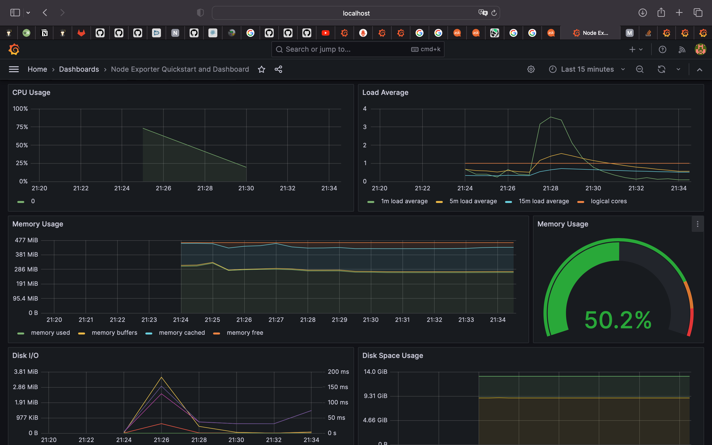
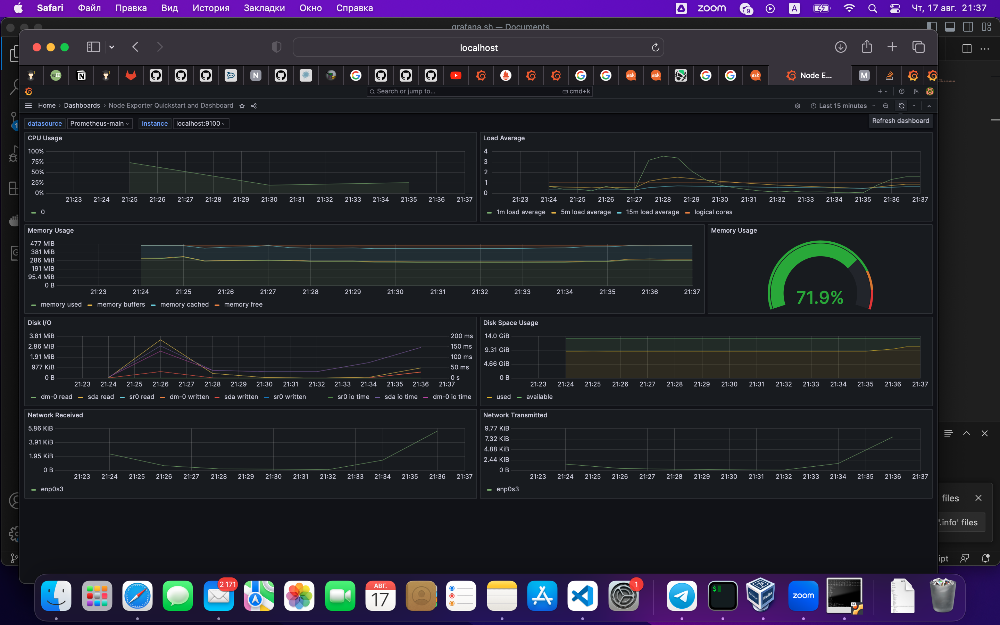
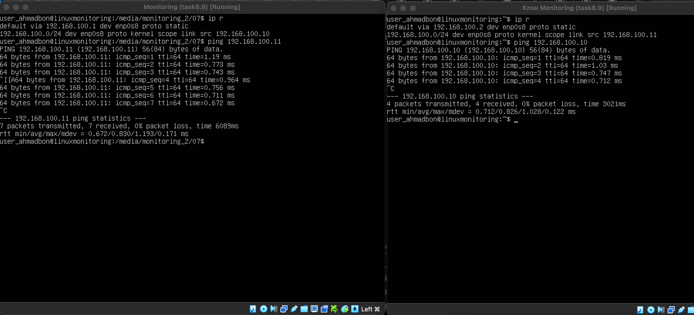
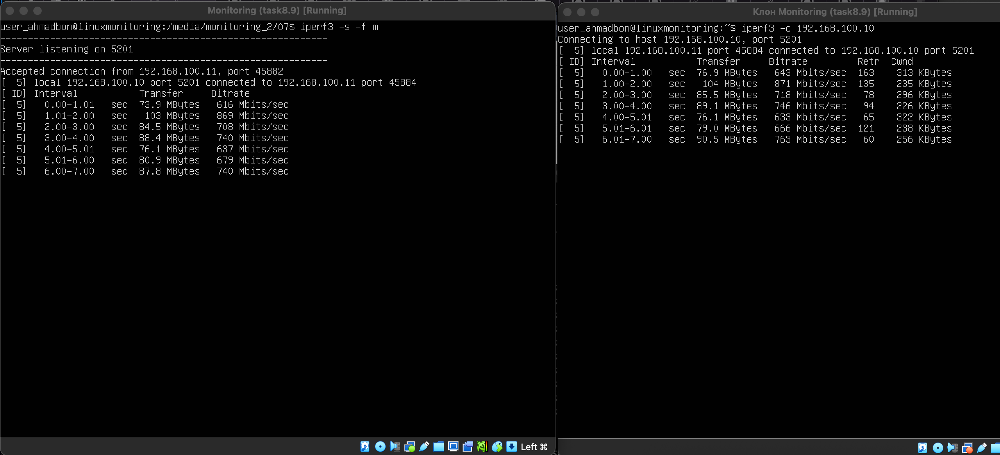
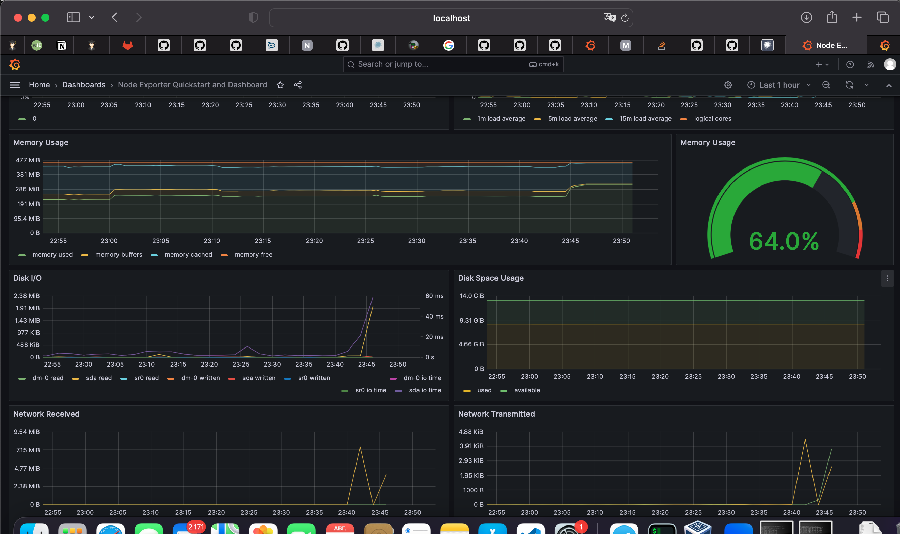

# Part 7. Prometheus и Grafana

* Запускаем стресс тест через stress -c 2 -i 1 -m 1 --vm-bytes 32M -t 10s
* Данные после

* Запускаем скрипт из задания 2

* Подклюяаем еще одну ВМ в ту же сеть

* запуск iperf3

* проверка нагрузки сетевого интерфейса

