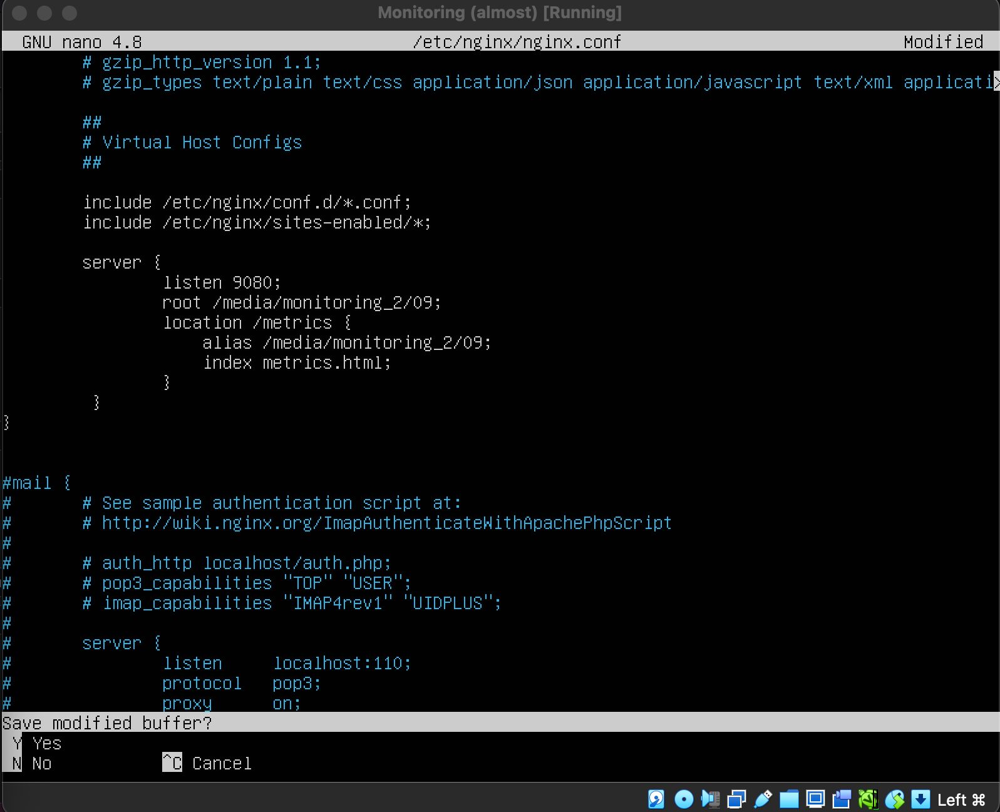
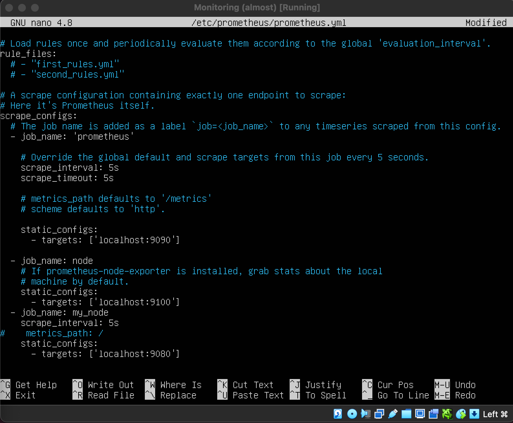
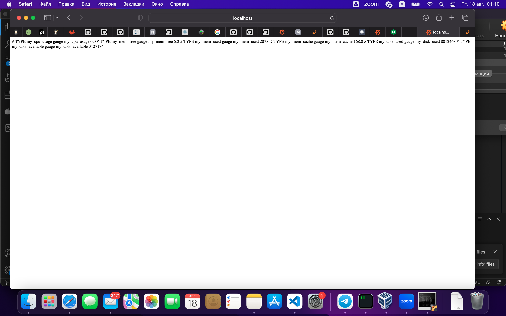
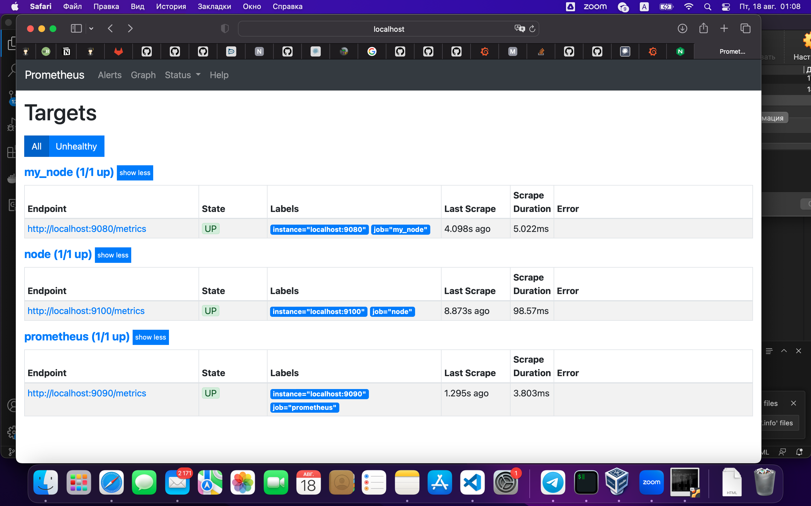
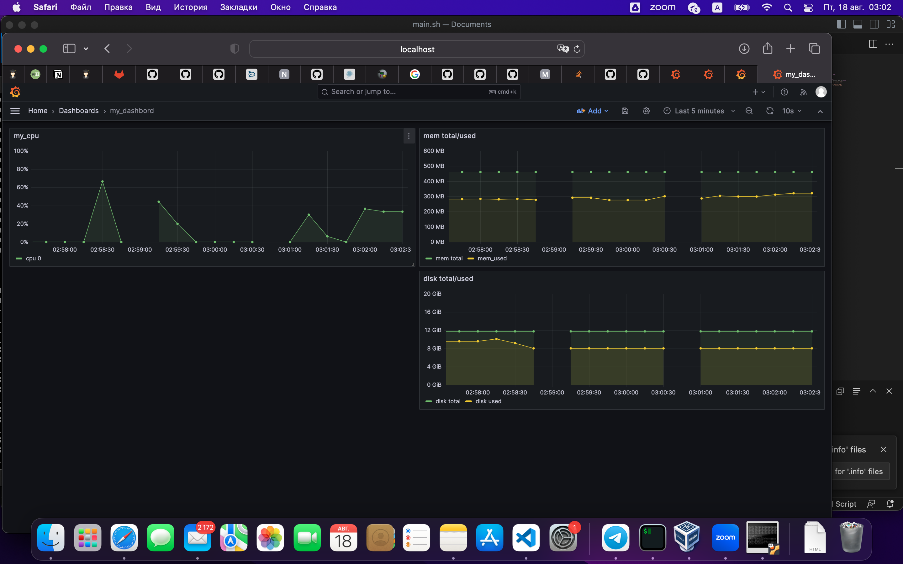
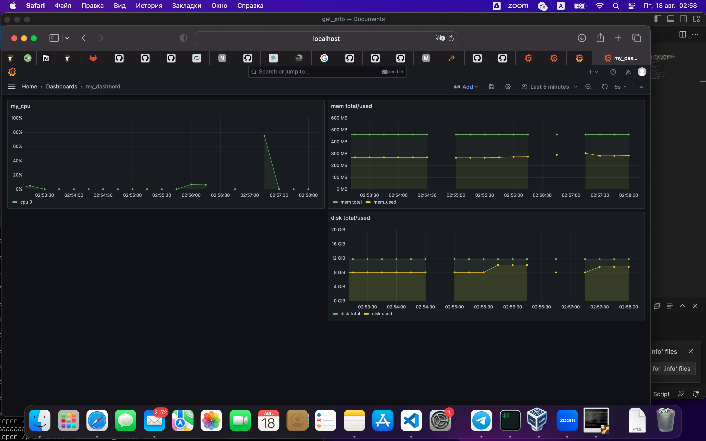

# Part 7. Prometheus и Grafana

* изменения nginx.conf

* изменения prometheus.conf

* доступ к моему моему node exporter

* получение prometheus моего node exporter

* Запускаем стресс тест через stress -c 2 -i 1 -m 1 --vm-bytes 32M -t 10s
* Данные после

* Запускаем скрипт из задания 2

